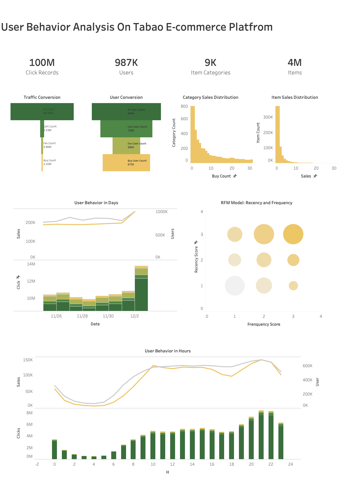

# User Behavior Analysis

## Overview

Business Backgroud  
Taobao is a Chinese online shopping platform. It is headquartered in Hangzhou and is owned by Alibaba. According to Alexa rank, it is the eighth most-visited website globally in 2021.(source:wikipedia) 
 
Dataset: User_Behavior  
The dataset of this project contains all the behaviors of about 1 million random users with behaviors (behaviors including pageview, favorite, cart, buy ) between  2017-11-25 to 2017-12-3 on the Taobao platform. Each row of the dataset represents a user behavior, which consists of user_id, item_id, category_id, behavior_type, timestamp.  
https://tianchi.aliyun.com/dataset/dataDetail?dataId=649&userId=1 
 
Dataset Size 
index: 100,150,807 
user_id: 987,994  
item_id: 4,162,024 
category_id: 9,439 

## 1.Business Analysis

Goal for the platform app: 1. Incresing profit/sales. 2.Improving the amount of buyer and seller  
How: Ceate KPIs and compare to the base line, find hidden information from buyer user, to support operation and product stragy making.  
(real scenario: gathering reuiqrements: from operation deparment - user centerted, or product deparment - product centerted)  

## 2.Data Collection 
There are several different approaches to handle the original data: 
Data Form: CSV File - SQL Database - pandas DataFram - Spark DataFrame 
Reference: Data Integration: ETL extract, transform and load. Big Data: batach processing, configuration. 

## 3. Data Cleaninging 
Column: column name, datatype  
Value: null, repeated, anomoly(constrain)  

## 4. Data Analysis 
Pyspark Solution: see git pyspark.ipynb file 
Mysql Solution: see git sql folder  

## 5. Data Visualization and Interpretation 
Tableau Solution  
  
  
Interpretation:   
User Conversion: Although the traffic conversion rate is low, the customer conversion rate is not. This means customers are comparing different items through the plafdorm. Big e-commerce platform can have low traffice conversion rate as the norm. The conversion rates should be compared to the similar platform instead of the indutry average.  
User Habit: There is a jump of clicks, sales and platform users on 2017-12-01.This maybe be due to the sales promotion. The click reaches the peak at 21:00 of the day. However, the amount of sales and users are relatively staeady after 10:00 . And 18:00 is the lowerst point of sales after 10:00 and the common time for dinner in China. This information can be provide to the sellers to plan for customer service.  
User Value: RFM model...  
User Preference: long tail effect...  

## 6.Further Development 
ML Modeling: Recomendation System  
ML Visualizationa and Interpretation: shap value for explainable AI  
