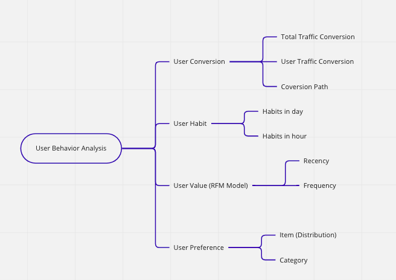

# User Behavior Analysis

## Overview

Business Backgroud  
Taobao is a Chinese online shopping platform. It is headquartered in Hangzhou and is owned by Alibaba. According to Alexa rank, it is the eighth most-visited website globally in 2021.(source:wikipedia) 
 
Dataset: User_Behavior  
The dataset of this project contains all the behaviors of about 1 million random users with behaviors (behaviors including pageview, favorite, cart, buy ) between  2017-11-25 to 2017-12-3 on the Taobao platform. Each row of the dataset represents a user behavior, which consists of user_id, item_id, category_id, behavior_type, timestamp.  
https://tianchi.aliyun.com/dataset/dataDetail?dataId=649&userId=1 
 
Dataset Size 
index: 100,150,807 
user_id: 987,994  
item_id: 4,162,024 
category_id: 9,439 

## 1.Business Analysis

Goal for the platform app: 1. Incresing profit/sales 2.Improving the amount of buyer and seller  
How: Ceate KPIs and compare to the base line, find hidden information from buyer user, to support operation and product stragy making.  
(real scenario: gathering reuiqrements: from operation deparment - user centerted, or product deparment - product centerted)  

User Conversion: improve conversion rate  
User Habit: target active users  
User Value: different strategies for different users  
User Preference: include the seller users  

## 2.Data Collection 
There are different approaches. 
Data Form: CSV File - SQL Database - pandas DataFram - Spark DataFrame 
Related Field: Data Integration: ETL extract, transform and load.Big Data: batach processing, configuration. 

## 3. Data Cleaninging 
field/column: datatype, constrain  
value: null, repeated, anomoly  

## 4. Data Analysis 
See SQL Folder  

## 5. Data Visualization and Interpretation 
See Tableau  

## 6.Further Development 
Replacing sql with pandas or pyspark https://www.kaggle.com/code/fanjingwen/user-behavior-analysis/edit/run/99646720 
ML Modeling: Recomendation System  
ML Visualizationa and Interpretation: shap value for explainable AI  
